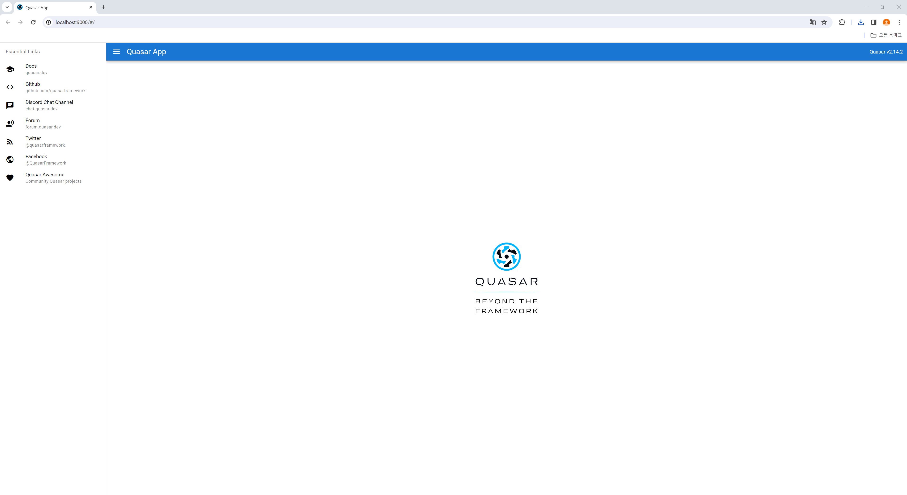

# Vite plugin for Quasar


## 애플리케이션 생성 및 실행하기

```cmd
$ npm init vite [앱 이름]
$ cd [프로젝트 디렉터리]
$ npm install --save quasar @quasar/extras
$ npm install --save-dev @quasar/vite-plugin sass@^1.33.0
$ npm run dev
```
<center>


</br>


</center>

## Quasar 컴포넌트 사용하기

### loading 컴포넌트를 예시로 들자면 

</br>

1. quasar에서 필요한 컴포넌트를 import한다.

</br>

2. plugins와 config에 사용할 컴포넌트를 명시해준다.

</br>

3. quasar 컴포넌트를 사용할 vue 파일에 $q 객체를 선언하고 사용한다.

</br>

```js
// main.js
import { createApp } from 'vue'
import { Quasar, Loading } from 'quasar'
import App from './App.vue'

// Import Quasar css
import 'quasar/src/css/index.sass'

const myApp = createApp(App)

myApp.use(Quasar, {
  plugins: {
    Loading
  }, // import Quasar plugins and add here

  config: {
    loading: {}
  }
})

myApp.mount('#app')
```

<br>

```html
<!-- components/Loading.vue -->
<script setup>
import {useQuasar} from 'quasar';

const $q = useQuasar();

function showLoading() {
  
  $q.loading.show({
    delay: 1000,
  });
  $q.loading.hide();
}
</script>

<template>
    <button @click="showLoading">로딩버튼</button>
    <q-loading></q-loading>
</template>

<style scoped>
</style>

```

<br>

* 프로젝트 실행 예제 이미지
<center>
  
</center>